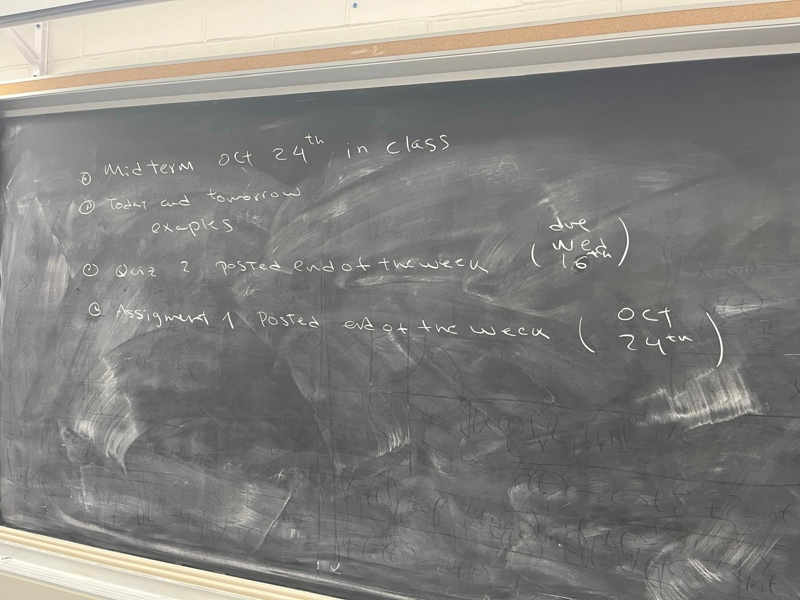

# CHEM 3PC3 - Mathematical Tools for Chemical Problems 
 
## Course Description 

This course covers essential mathematical topics as tools for solving problems in chemistry. The theme of the first part of the course is thermodynamics calculations. The second part is concerned with linear algebra. Chemical problems associated with equilibrium and kinetics are introduced and solved via calculus and linear algebra. As such, linear algebra - solving systems of linear equations, matrix algebra, eigenvalues and eigenvectors – and some multivariate calculus topics are introduced in a physical context. The course will also cover a brief introduction to model regression algorithms like neural networks. 
One of the main focuses of the course is the development of coding skills, specifically Python. 
Instruction on the associated programming skills will be provided in tutorials. 

## Outline

The outline of the course can be found [here](https://github.com/ChemAI-Lab/Math4Chem/blob/main/website/Lecture_Notes/outline_F2025.pdf) 

## Resources 

This course does not follow a specific book as it designed to be a collection of topics that are relevant for a common undergraduate program in chemistry. However, if the student wants to consult here are some recommended books:

1.	Applied mathematics for Physical Chemistry, James R. Barrante.
2.	Mathematics for Physical Chemistry, Donald A. McQuarrie.
3.	Physical Chemistry, Ira N. Levine.
4.	Linear Algebra with applications, Gareth Williams.
5.  [Matrix cookbook](https://www.math.uwaterloo.ca/~hwolkowi/matrixcookbook.pdf)

Notes from previous years wrote by profs. Randy Dumont and Paul Ayers will also be shared.

## Midterm and assignment dates  
<!-- * **Final**, Dec 6, bring your calculator. -->
<!-- * Practice questions [pdf](https://github.com/ChemAI-Lab/Math4Chem/blob/main/website/Lecture_Notes/final_practice_material.pdf) (**this file will be constantly updated!**) -->
<!-- * **Quiz 2**, due to Dec 6.    -->
<!--   Print the following file and answer the questions, [pdf](https://github.com/ChemAI-Lab/Math4Chem/blob/main/website/Lecture_Notes/quiz2.pdf)  -->
<!--   (You can hand it before the final exam. If your are an ASA student, drop your Quiz in CCB's main office mailbox. I will not accept any Quiz2 once the final exam starts.)  -->
* **Midterm**, Oct 30 in class, bring your calculator.
   **Time**: 8:00 AM to 10:30 AM 
   **Room**: ABB 165 

<!--   * Practice questions [pdf](https://github.com/ChemAI-Lab/Math4Chem/blob/main/website/Lecture_Notes/midterm_practice_material.pdf) -->
<!--   * **Midterm answers** [pdf](https://github.com/ChemAI-Lab/Math4Chem/blob/main/website/Lecture_Notes/midterm_1_answer_key.pdf) -->
* **Assignment 1**, due to Oct 24th 5:00 PM EST. 
  * Info: [link](https://chemai-lab.github.io/Math4Chem/Assignments/assignments_info.html)
<!--   * Link to the assignment  -->
<!--   * Link to the assignment solution  -->
<!--  -->
* **Assignment 2**, due to Dec 4. 
<!--   * Link to the assignment  -->
<!--  -->

## Classes 
The classes will be held in ETB 227 on Tuesday 9:30AM - 10:20AM and on Thursday 8:30AM - 10:20AM. 

1. Introduction to the course:  
   

2. Introduction to Derivatives  
     
   **Additional of References**
   1. Chapter 1, Physical Chemistry, Ira N. Levine.
   2. Chapter 1, Mathematics for Physical Chemistry, Donald A. McQuarrie.

3. Introduction to Integrals  
    
   **Additional of References**
   1. Chapter 1, Physical Chemistry, Ira N. Levine.
   2. Chapter 1, Mathematics for Physical Chemistry, Donald A. McQuarrie.

4. Introduction to Thermodynamics  
     
   **Additional of References**
   1. Chapters 1 and 2, Physical Chemistry, Ira N. Levine.

5. Introduction to Linear Algebra  
     
   **Additional of References**
   1. Chapter 13, Mathematics for Physical Chemistry, Donald A. McQuarrie.
   2. Chapter 1, Linear Algebra with applications, Gareth Williams.

<!-- 5. Introduction to Linear Regression [[Notes]](https://github.com/ChemAI-Lab/Math4Chem/blob/main/website/Lecture_Notes/Notes/Linear_Regression.pdf)  -->
<!--    **Additional of References**   -->
<!--    1. Chapter 1 and 6, Linear Algebra with applications, Gareth Williams. -->
<!--    2. Additional notes [link](https://www.stat.cmu.edu/~cshalizi/mreg/15/lectures/13/lecture-13.pdf) -->
<!--    * Notes will be available this time through  -->
<!--  -->
<!-- 6. NonLinear Equations [[Notes]](https://github.com/ChemAI-Lab/Math4Chem/blob/main/website/Lecture_Notes/Notes/Nonlinear_Equations.pdf)   -->
<!--    * Notes will be available this time through  -->
<!--  -->
<!-- 7. Chemical Kinetics [[Notes]](https://github.com/ChemAI-Lab/Math4Chem/blob/main/website/Lecture_Notes/Notes/[text](Lecture_Notes/Notes/Chemical_kinetics.pdf).pdf)   -->
<!--   **Additional of References** -->
<!--    1. Chapter 17, Physical Chemistry, Ira N. Levine. -->
<!--    * Notes will be available this time through  -->
<!--  -->
<!-- 1. Eigenvalue Decomposition  [[Notes]](https://github.com/ChemAI-Lab/Math4Chem/blob/main/website/Lecture_Notes/Notes/[text](Lecture_Notes/Notes/Eigenvalue_problem.pdf).pdf)   -->
<!--    **Additional of References**   -->
<!--    1. Chapters 18 and 19, Mathematics for Physical Chemistry, Donald A. McQuarrie. -->
<!--    2.  [MIT notes](https://math.mit.edu/~jorloff/suppnotes/suppnotes03/la5.pdf) -->
<!--    3.  [LibreText Mathematics](https://math.libretexts.org/Bookshelves/Differential_Equations/Differential_Equations_(Chasnov)/07%3A_Systems_of_Equations/7.02%3A_Coupled_First-Order_Equations#mjx-eqn-eq%3A2) -->
<!--    4.  [University of Bristol](https://people.maths.bris.ac.uk/~maajh/ODEs/chap4.pdf) -->
<!--      * Parts of the notes will be available this time through -->
<!--   -->
<!--  -->
**** 

## Coding in class
1. Introduction to Python:   
   **Answers**: 

2. Introduction to derivatives and integrals:   
   **Answers**: 

3. Introduction to Thermodynamics:   
   **Answer**:  

4. Introduction to Linear Algebra: 

<!-- 4. Matrix operations  -->
<!-- 5. Linear Regression  -->
<!-- 6. Polynomial Regression  -->
<!-- 7. Gradient Descent and Newton's Method  -->
<!-- 8. Chemical Kinetics -->
<!-- 9. Eigenvalue Decomposition  -->
<!-- 10. Introduction to Neural Networks   -->
<!-- 1.  Introduction to RdKit   -->
<!--  -->

## Tutorials

The tutorials will be held in  HH 102 on Tuesday 1:30 PM – 2:20 PM.

**Attention** There is no tutorial today, September 30. 

1. Python Introduction: 
2. Python Functions and derivatives: 
3. Continuation of Python Functions and derivatives: 
3. Numerical Integration: 
<!--    **Coding**  -->
<!--    1. Alternating Series  -->
<!--  -->
<!-- 2. SymPY [[pdf]](https://mcmasteru365-my.sharepoint.com/:p:/g/personal/decamara_mcmaster_ca/ER0eOwXjrfZOlheg3cF85XwBe8bIRawBXdAxFKFOJTDUkQ?e=eVR3J9)   -->
<!--  -->
<!-- 3. Linear Algebra  -->
<!--  -->
<!-- 4. Neural netowrks and Regression Model  -->
<!--  -->
<!-- 5. Challenge Regression Model  -->

## Weekly Quizzes

1. Quiz 1: **Deadline:** 16 September 2025, 2:20 PM  
    
  
   **Comments**: For question 4, you do not necessarily need to use Python's sum function.

2. Quiz 2: **Deadline:** 23 September 2025, 2:20 PM  
    

   **Comments**: Only for question 1 that you **must** use the definition of the derivative given by the limit.

3. Quiz 3: **Deadline:** 30 September 2025, 2:20 PM  
     
     

   **Comments**: 
   * For the coding part of the quiz, it is recommended that you use the step size, h, to determine how to split the interval (0, 2).  
   * This is a combined Math and Coding exercise. The assignment consists of two math questions (a, b, c, d) accessible via the PDF link, and two coding questions in the Google Colab notebook. To receive a full grade, you must complete all exercises and follow the submission instructions below.

4. Quiz 4:   **Deadline:** 14 October 2025, 2:20 PM  
     
   

## Weekly Quizzes Instructions 
A new list of quizzes will be provided each tutorial. These exercises are to be completed individually and are due by the end of the next tutorial session.

There are three types of quizzes, each with its own submission method. Please follow these instructions carefully to ensure your work is accepted.
1.	Coding Quizzes:
These must be submitted electronically by email to decamara@mcmaster.ca. 
**Important:** You must use the following naming template for your submission file:
STUDENT_SURNAME_STUDENT_ID_QUIZ_NUMBER.ipynb
(e.g., SMITH_001234567_QUIZ_2.ipynb).
2.	Exercises with Mathematical Calculations (Pencil and Paper): 
These will be uploaded as PDF files. It is your responsibility to download and print them. You must write your full name and student number on the cover page. Submissions without this identification will not be accepted. These must be submitted in person to the teaching assistant (monitor) by the end of the tutorial section in which they are due.
**Alternative submission**: If you want you can email me a single PDF file containing your scanned answers. Do not upload separate photos, merge them into one PDF, placing the exercise sheet as the first page. You can use [CamScanner](https://www.camscanner.com/download) to scan your photos and convert them into a PDF. Ensure your name, student ID, and tutorial number are clearly written on the submission.
**Important:** If you are going to do the **Alternative submission**, you must use the following naming template for your submission file:
STUDENT_SURNAME_STUDENT_ID_QUIZ_NUMBER.pdf
(e.g., SMITH_001234567_QUIZ_2.pdf).
3.	Combined Math and Coding Exercises: 
   For these exercises, you must complete both parts:
      -   Coding Part: Email your code to decamara@mcmaster.ca, using the required file naming template: STUDENT_SURNAME_STUDENT_ID_QUIZ_NUMBER.ipynb.
      -	Math Calculations Part: Submit your pencil and paper calculations in person during the tutorial session in which they are due. Alternatively, they may be emailed to decamara@mcmaster.ca merged into one PDF using the required file naming template: STUDENT_SURNAME_STUDENT_ID_QUIZ_NUMBER.pdf. 
      - Both parts must be submitted by the deadline for your work to be considered complete.

## Weekly Quizzes Grades

| Serial Number | QUIZ 1 (TOTAL = 10) | QUIZ 2 (TOTAL = 10) |
| :--- | :--- | :--- |
| 7X9B | 10 | 9 |
| L83P | 10 | 10 |
| Z4M2 | N/A | N/A |
| 9JN1 | 10 | 10 |
| K55H | 9.5 | 9 |
| R8D3 | 10 | 9.9 |
| 2F7Y | 10 | 10 |
| M3B8 | 9 | 10 |
| P61K | 10 | 9.9 |
| W4U7 | 10 | 10 |
| 0H4S | 10 | 10 |
| G2V5 | 10 | 10 |
| 3C9L | 10 | 10 |
| D5T1 | 10 | 10 |
| X8N0 | 10 | 10 |
| 1Q7W | 10 | 10 |
| J6R9 | 10 | 10 |
| S3K5 | 10 | 10 |
| 4E8B | 10 | 9 |
| N2Y7 | N/A | N/A |